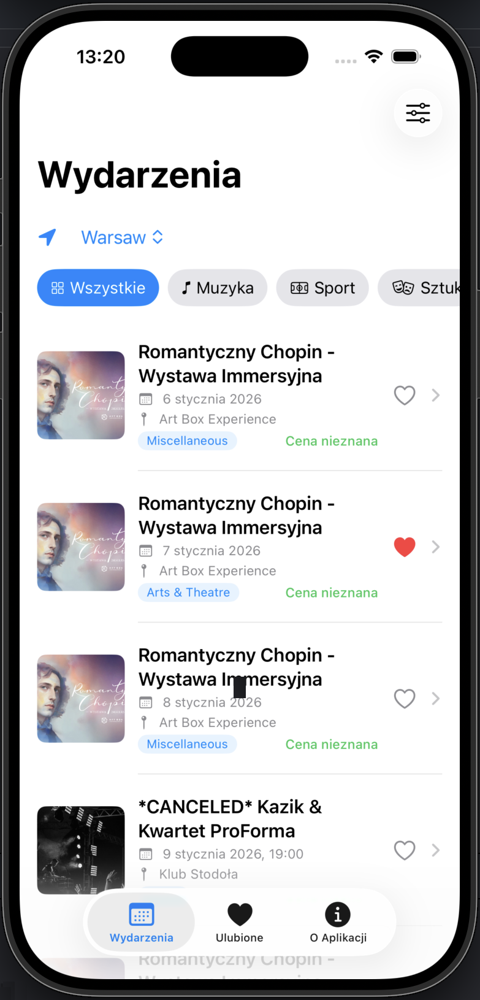
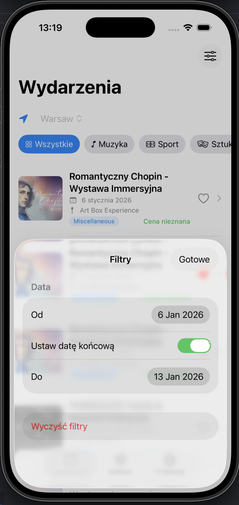
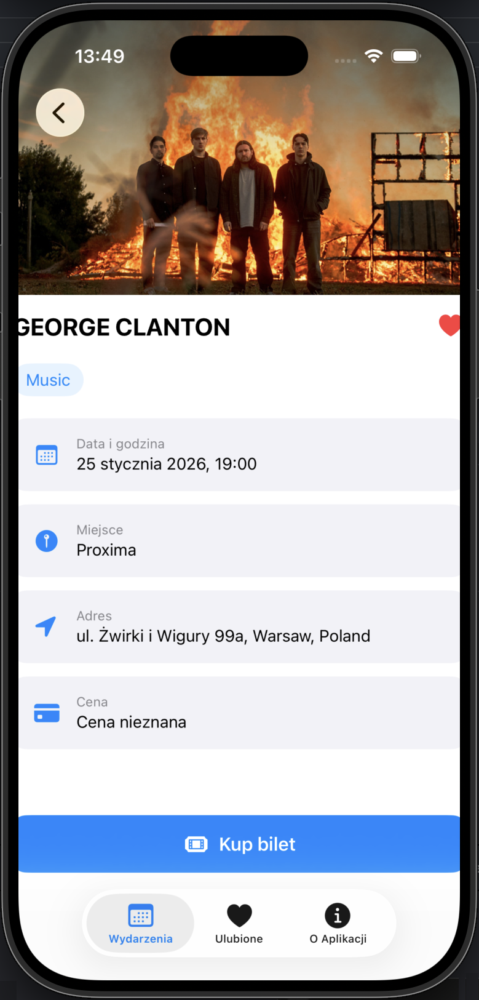
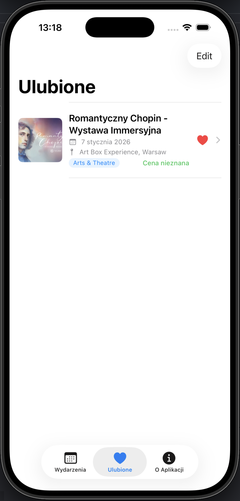
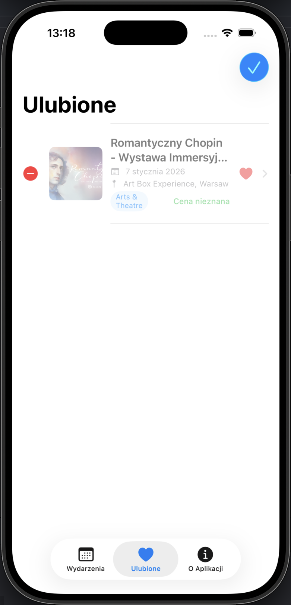
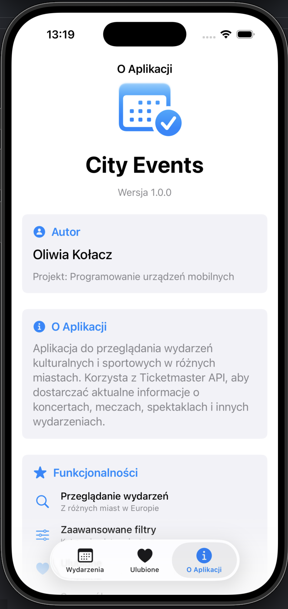
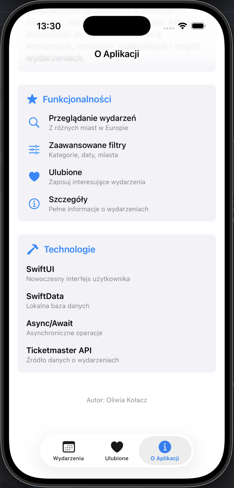

# City Events

Aplikacja do przeglądania wydarzeń w różnych miastach przy użyciu Ticketmaster API.

## Autor
**Oliwia Kołacz**  
Cel: Projekt na "Programowanie urządzeń mobilnych"

## Funkcjonalności

- **Przeglądanie wydarzeń** - Wydarzenia z różnych miast europejskich
- **Wybór miasta** - Warsaw, Krakow, Gdansk, Wroclaw, Poznan, Berlin, Prague, Vienna i inne
- **Filtrowanie po kategoriach** - Muzyka, Sport, Sztuka, Film, Inne
- **Filtrowanie po datach** - Zakres dat z zaawansowanymi filtrami
- **Ulubione wydarzenia** - Zapisywanie z SwiftData (offline)
- **Szczegóły wydarzeń** - Pełne informacje, miejsce, cena, link do biletów
- **Pociągnij, aby odświeżyć** - Odświeżanie listy wydarzeń
- **Nieskończone przewijanie** - Automatyczne ładowanie kolejnych stron
- **Zakładka "O Aplikacji"** - Informacje o autorze i aplikacji
- **Dark Mode** - Pełne wsparcie dla trybu ciemnego

## Technologie

- **SwiftUI** - Interfejs użytkownika
- **Swift Concurrency** (async/await) - Asynchroniczne operacje
- **SwiftData** - Lokalna baza danych dla ulubionych
- **Combine** - Reactive programming dla ViewModels
- **Ticketmaster API** - Źródło danych o wydarzeniach

## Struktura projektu

```
CityEvents/
├── App/
│   └── CityEventsApp.swift
│
├── Models/
│   ├── Event.swift
│   ├── FavoriteEvent.swift
│   └── EventCategory.swift
│
├── ViewModels/
│   ├── EventsViewModel.swift
│   └── FavoritesViewModel.swift
│
├── Views/
│   ├── ContentView.swift
│   ├── HomeView.swift
│   ├── EventRowView.swift
│   ├── EventDetailView.swift
│   ├── FavoritesView.swift
│   ├── FavoriteRowView.swift
│   ├── FavoriteDetailView.swift
│   └── AboutView.swift
│
├── Services/
│   └── NetworkService.swift
│
└── Resources/
    └── Assets.xcassets
```

### Architektura MVVM

- **Models** - Struktury danych (Event, FavoriteEvent, EventCategory)
- **Views** - Interfejs użytkownika (SwiftUI views)
  - Główny widok: ContentView (TabView)
  - Wydarzenia: HomeView, EventRowView, EventDetailView
  - Ulubione: FavoritesView, FavoriteRowView, FavoriteDetailView
  - Informacje: AboutView
- **ViewModels** - Logika biznesowa i stan aplikacji (EventsViewModel, FavoritesViewModel)
- **Services** - Warstwa sieciowa i komunikacja z Ticketmaster API

## Wymagania

- **iOS 17.0+**
- **Xcode 15.0+**
- **Swift 6.0+**

## Instalacja i uruchomienie

1. **Sklonuj repozytorium**
2. **Otwórz projekt w Xcode**
3. **Zarejestruj się na [Ticketmaster Developer Portal](https://developer.ticketmaster.com/)**
   - Utwórz darmowe konto
   - Wygeneruj klucz API
4. **Wstaw swój klucz API w `NetworkService.swift`:**
   ```swift
   private let apiKey = "API_KEY"
   ```
5. **Uruchom projekt na symulatorze lub urządzeniu** (⌘R)

## Kluczowe funkcje techniczne

### 🔄 Asynchroniczne operacje (Swift Concurrency)
```swift
@MainActor
class EventsViewModel: ObservableObject {
    func loadEvents() async {
        // Bezpieczne wywołania async/await
    }
}
```

### 💾 SwiftData dla ulubionych
```swift
@Model
class FavoriteEvent {
    var id: String
    var name: String
    var dateAdded: Date
    // Automatyczna persystencja offline
}
```

### ♾️ Paginacja i nieskończone przewijanie
```swift
func loadMoreIfNeeded(currentEvent: Event) async {
    guard let lastEvent = events.last,
          lastEvent.id == currentEvent.id,
          hasMorePages else { return }
    // Automatyczne ładowanie kolejnej strony
}
```

### ⚡ Reactive ViewModels z Combine
```swift
@Published var selectedCity: String = "Warsaw" {
    didSet { 
        Task { await refreshEvents() }
    }
}
```

## Zrzuty ekranu

### Główny widok
- Lista wydarzeń z obrazkami
- Filtry: miasto, kategoria, daty
- Przycisk ulubione dla każdego wydarzenia




### Szczegóły wydarzenia
- Pełne informacje o wydarzeniu
- Lokalizacja i data
- Przycisk "Kup bilet" (link do Ticketmaster)



### Ulubione
- Lista zapisanych wydarzeń
- Trwałe przechowywanie z SwiftData
- Szybkie usuwanie z ulubionych




### O Aplikacji
- Informacje o autorze
- Lista funkcjonalności
- Użyte technologie




## 🔧 API Ticketmaster

Aplikacja używa [Ticketmaster Discovery API v2](https://developer.ticketmaster.com/products-and-docs/apis/discovery-api/v2/):

- **Endpoint**: `https://app.ticketmaster.com/discovery/v2/events.json`
- **Parametry**: miasto, kategoria, zakres dat, paginacja
- **Limity**: Sprawdź limity swojego klucza API na portalu developerskim
- **Dokumentacja**: [developer.ticketmaster.com](https://developer.ticketmaster.com/)

## 📱 Wymagania systemowe

- iPhone lub iPad z iOS 17.0 lub nowszym
- Połączenie z internetem (dla pobierania wydarzeń)
- ~50 MB miejsca na urządzeniu
